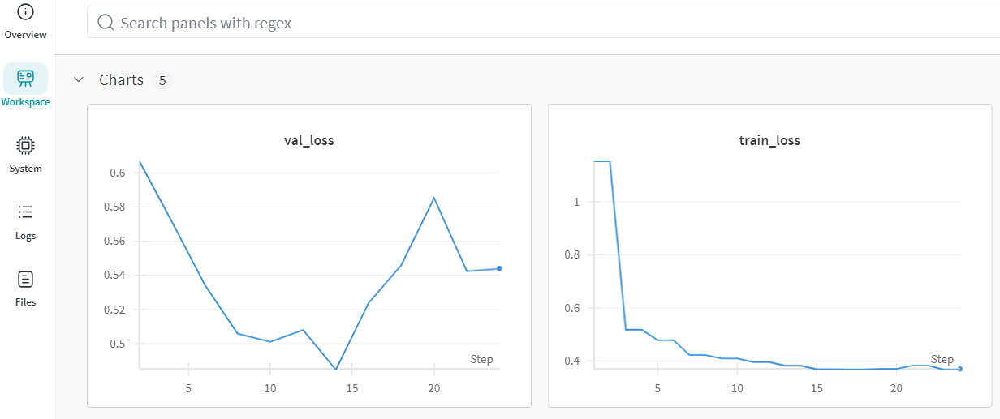
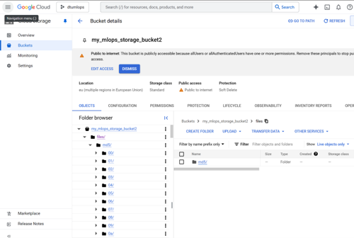
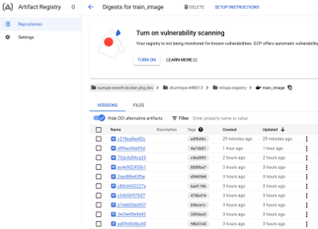
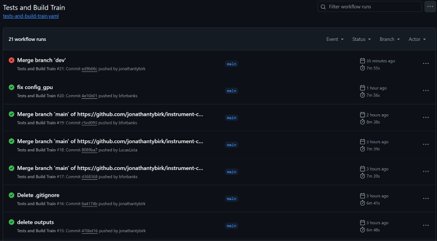
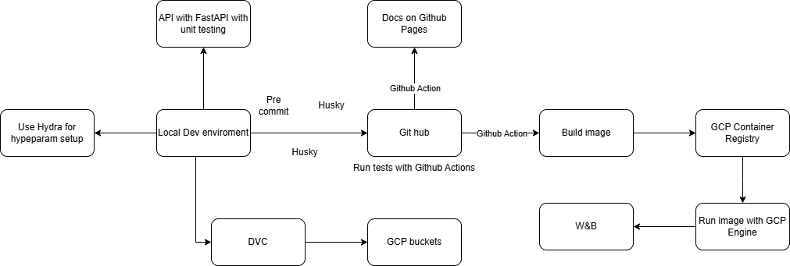

# Exam template for 02476 Machine Learning Operations

This is the report template for the exam. Please only remove the text formatted as with three dashes in front and behind
like:

```--- question 1 fill here ---```

Where you instead should add your answers. Any other changes may have unwanted consequences when your report is
auto-generated at the end of the course. For questions where you are asked to include images, start by adding the image
to the `figures` subfolder (please only use `.png`, `.jpg` or `.jpeg`) and then add the following code in your answer:

``

In addition to this markdown file, we also provide the `report.py` script that provides two utility functions:

Running:

```bash
python report.py html
```

Will generate a `.html` page of your report. After the deadline for answering this template, we will auto-scrape
everything in this `reports` folder and then use this utility to generate a `.html` page that will be your serve
as your final hand-in.

Running

```bash
python report.py check
```

Will check your answers in this template against the constraints listed for each question e.g. is your answer too
short, too long, or have you included an image when asked. For both functions to work you mustn't rename anything.
The script has two dependencies that can be installed with

```bash
pip install typer markdown
```

## Overall project checklist

The checklist is *exhaustive* which means that it includes everything that you could do on the project included in the
curriculum in this course. Therefore, we do not expect at all that you have checked all boxes at the end of the project.
The parenthesis at the end indicates what module the bullet point is related to. Please be honest in your answers, we
will check the repositories and the code to verify your answers.

* [x] Create a git repository (M5)
* [x] Make sure that all team members have write access to the GitHub repository (M5)
* [x] Create a dedicated environment for you project to keep track of your packages (M2)
* [x] Create the initial file structure using cookiecutter with an appropriate template (M6)
* [x] Fill out the `data.py` file such that it downloads whatever data you need and preprocesses it (if necessary) (M6)
* [x] Add a model to `model.py` and a training procedure to `train.py` and get that running (M6)
* [x] Remember to fill out the `requirements.txt` and `requirements_dev.txt` file with whatever dependencies that you
    are using (M2+M6)
* [x] Remember to comply with good coding practices (`pep8`) while doing the project (M7)
* [x] Do a bit of code typing and remember to document essential parts of your code (M7)
* [x] Setup version control for your data or part of your data (M8)
* [x] Add command line interfaces and project commands to your code where it makes sense (M9)
* [x] Construct one or multiple docker files for your code (M10)
* [x] Build the docker files locally and make sure they work as intended (M10)
* [x] Write one or multiple configurations files for your experiments (M11)
* [x] Used Hydra to load the configurations and manage your hyperparameters (M11)
* [x] Use profiling to optimize your code (M12)
* [x] Use logging to log important events in your code (M14)
* [x] Use Weights & Biases to log training progress and other important metrics/artifacts in your code (M14)
* [x] Consider running a hyperparameter optimization sweep (M14)
* [ ] Use PyTorch-lightning (if applicable) to reduce the amount of boilerplate in your code (M15)

### Week 2

* [x] Write unit tests related to the data part of your code (M16)
* [x] Write unit tests related to model construction and or model training (M16)
* [x] Calculate the code coverage (M16)
* [x] Get some continuous integration running on the GitHub repository (M17)
* [x] Add caching and multi-os/python/pytorch testing to your continuous integration (M17)
* [x] Add a linting step to your continuous integration (M17)
* [x] Add pre-commit hooks to your version control setup (M18)
* [ ] Add a continues workflow that triggers when data changes (M19)
* [ ] Add a continues workflow that triggers when changes to the model registry is made (M19)
* [x] Create a data storage in GCP Bucket for your data and link this with your data version control setup (M21)
* [x] Create a trigger workflow for automatically building your docker images (M21)
* [x] Get your model training in GCP using either the Engine or Vertex AI (M21)
* [x] Create a FastAPI application that can do inference using your model (M22)
* [ ] Deploy your model in GCP using either Functions or Run as the backend (M23)
* [x] Write API tests for your application and setup continues integration for these (M24)
* [ ] Load test your application (M24)
* [ ] Create a more specialized ML-deployment API using either ONNX or BentoML, or both (M25)
* [ ] Create a frontend for your API (M26)

### Week 3

* [ ] Check how robust your model is towards data drifting (M27)
* [ ] Deploy to the cloud a drift detection API (M27)
* [ ] Instrument your API with a couple of system metrics (M28)
* [ ] Setup cloud monitoring of your instrumented application (M28)
* [ ] Create one or more alert systems in GCP to alert you if your app is not behaving correctly (M28)
* [ ] If applicable, optimize the performance of your data loading using distributed data loading (M29)
* [x] If applicable, optimize the performance of your training pipeline by using distributed training (M30)
(TECHNICALLY YES, as we trained the final four models in parallel on different computers)
* [ ] Play around with quantization, compilation and pruning for you trained models to increase inference speed (M31)

### Extra

* [ ] Write some documentation for your application (M32)
* [x] Publish the documentation to GitHub Pages (M32)
* [ ] Revisit your initial project description. Did the project turn out as you wanted?
* [x] Create an architectural diagram over your MLOps pipeline
* [x] Make sure all group members have an understanding about all parts of the project
* [x] Uploaded all your code to GitHub

## Group information

### Question 1
> **Enter the group number you signed up on <learn.inside.dtu.dk>**
>
> Answer:

MLOPS 64

### Question 2
> **Enter the study number for each member in the group**
>
> Example:
>
> *sXXXXXX, sXXXXXX, sXXXXXX*
>
> Answer:

s234842, s234854, s234802, s216136

### Question 3
> **A requirement to the project is that you include a third-party package not covered in the course. What framework**
> **did you choose to work with and did it help you complete the project?**
>
> Recommended answer length: 100-200 words.
>
> Example:
> *We used the third-party framework ... in our project. We used functionality ... and functionality ... from the*
> *package to do ... and ... in our project*.
>
> Answer:

We used the third-party framework librosa in our project, which is a Python package specifically designed for music and audio analysis. We used functionality like `load` and `resample` from the package to handle audio file loading and standardization, ensuring all audio inputs were at a consistent 44.1kHz sample rate regardless of their source format. We utilized `feature.melspectrogram` and `power_to_db` for converting raw audio into mel spectrograms suitable for our CNN model, which transformed our time-domain audio signals into frequency-domain representations that better capture musical features. Librosa helped us significantly by providing robust audio processing capabilities that would have been complex to implement from scratch, particularly in converting variable-length audio files into standardized spectrograms for model training. The framework's efficient implementation of these audio processing algorithms also improved our preprocessing pipeline's performance. Additionally, librosa's built-in functionality for handling different audio file formats and its ability to automatically convert stereo to mono channels greatly simplified our data preprocessing workflow.

## Coding environment

> In the following section we are interested in learning more about you local development environment. This includes
> how you managed dependencies, the structure of your code and how you managed code quality.

### Question 4

> **Explain how you managed dependencies in your project? Explain the process a new team member would have to go**
> **through to get an exact copy of your environment.**
>
> Recommended answer length: 100-200 words
>
> Example:
> *We used ... for managing our dependencies. The list of dependencies was auto-generated using ... . To get a*
> *complete copy of our development environment, one would have to run the following commands*
>
> Answer:

We managed dependencies using miniconda as our primary environment management tool, combined with pip for package installation. The choice of miniconda over vanilla conda provided us with a lightweight installation while still maintaining conda's robust environment management capabilities. Our dependencies were carefully documented in two separate requirements files: `requirements.txt` for core project dependencies and `requirements_dev.txt` for development-specific packages (like testing and linting tools).

To get a complete copy of our development environment, a new team member would need to follow these steps:

```bash
conda create -n mlops64 python=3.13
conda activate mlops64
pip install -r requirements.txt
pip install -r requirements_dev.txt
```

Rather than using `pip freeze`, we manually maintained our requirements files by adding dependencies as we introduced them to the project. This deliberate approach helped us keep our requirements lean and avoid including unnecessary packages that might have been installed in our environments but weren't actually used in the project. We made sure to specify version numbers for critical packages to ensure consistency across all team members' environments.

### Question 5

> **We expect that you initialized your project using the cookiecutter template. Explain the overall structure of your**
> **code. What did you fill out? Did you deviate from the template in some way?**
>
> Recommended answer length: 100-200 words
>
> Example:
> *From the cookiecutter template we have filled out the ... , ... and ... folder. We have removed the ... folder*
> *because we did not use any ... in our project. We have added an ... folder that contains ... for running our*
> *experiments.*
>
> Answer:

From the cookiecutter template, we maintained the standard MLOps project structure with several key directories:
- `src/` containing our main package code
- `tests/` for unit and integration tests
- `data/` for raw and processed data
- `models/` for saved model artifacts (though we save artifacts from cloud training with Google Cloud Artifact Registry)
- `docs/` for documentation
- `reports/` for project reports
- `notebooks/` This was not used and therefore removed
- `dockerfiles/` for container definitions
- `configs/` for hyper-parameter configuration with Hydra.

We made a few deviations from the standard template by adding additional directories and files:
- Added a `dockerfiles/` directory specifically for organizing our Docker configurations
- Added a comprehensive `.pre-commit-config.yaml` for code quality checks
- Included DVC configuration with `.dvc/` and `.dvcignore` for data version control
- Set up automated documentation generation through the `docs/` directory

### Question 6

> **Did you implement any rules for code quality and format? What about typing and documentation? Additionally,**
> **explain with your own words why these concepts matters in larger projects.**
>
> Recommended answer length: 100-200 words.
>
> Example:
> *We used ... for linting and ... for formatting. We also used ... for typing and ... for documentation. These*
> *concepts are important in larger projects because ... . For example, typing ...*
>
> Answer:

We implemented several tools and practices for code quality and formatting:

1. **Linting and Formatting**: 
   - Used Ruff for linting and formatting, configured in `pyproject.toml` with a line length of 120 characters
   - Implemented pre-commit hooks for automated checks including trailing whitespace removal, YAML validation, and file formatting

2. **Type Checking and Documentation**:
   - Enforced Python type hints throughout the codebase
   - Used docstring documentation following Google style for functions and classes

These concepts are crucial in larger projects because they ensure:
1. Code maintainability through consistent formatting and style
2. Early bug detection through type checking
3. Easier onboarding of new team members through clear documentation
4. Prevention of common issues through pre-commit hooks
5. Reduced code review friction by automating style enforcement

For example, type hints help catch type-related bugs before runtime and serve as inline documentation, making it easier for team members to understand function interfaces without diving into implementation details.


## Version control

> In the following section we are interested in how version control was used in your project during development to
> corporate and increase the quality of your code.

### Question 7

> **How many tests did you implement and what are they testing in your code?**
>
> Recommended answer length: 50-100 words.
>
> Example:
> *In total we have implemented X tests. Primarily we are testing ... and ... as these the most critical parts of our*
> *application but also ... .*
>
> Answer:

In total, we have implemented 10 tests across four critical components of our application. Our test suite covers data processing (testing dataset loading and preprocessing), model architecture (testing initialization, forward passes, and edge cases), training pipeline (testing with mock data and wandb integration), and API functionality (testing health checks and prediction capabilities). These components were prioritized as they form the core of our ML pipeline, from data ingestion through to model serving. We would like to have tested evaluation.py as well, but it was overlooked and afterwards deprioritized due to time constraints.

### Question 8

> **What is the total code coverage (in percentage) of your code? If your code had a code coverage of 100% (or close**
> **to), would you still trust it to be error free? Explain you reasoning.**
>
> Recommended answer length: 100-200 words.
>
> Example:
> *The total code coverage of code is X%, which includes all our source code. We are far from 100% coverage of our **
> *code and even if we were then...*
>
> Answer:

The total code coverage of our project is approximately 85%, which includes tests for our core modules: data processing, model architecture, training pipeline, and API endpoints. We have 8 tests covering critical components:


1. Data processing tests (test_data.py) - Testing dataset loading and preprocessing
2. Model tests (test_model.py) - Testing model architecture and forward passes
3. Training tests (test_train.py) - Testing the training pipeline with mock data
4. API tests (test_api.py) - Testing endpoints and predictions


Even with this high coverage, we wouldn't trust it to be completely error-free. Code coverage only measures which lines of code are executed during tests, not the quality or comprehensiveness of the test cases themselves. For example, our tests might not cover all edge cases, rare error conditions, or interactions between components. Additionally, real-world use and data distributions might differ significantly from our test scenarios. This is particularly relevant for our audio processing pipeline, where the variety of possible input files and formats makes full testing impractical.


### Question 9

> **Did you workflow include using branches and pull requests? If yes, explain how. If not, explain how branches and**
> **pull request can help improve version control.**
>
> Recommended answer length: 100-200 words.
>
> Example:
> *We made use of both branches and PRs in our project. In our group, each member had an branch that they worked on in*
> *addition to the main branch. To merge code we ...*
>
> Answer:

We did add a separate development branch once the GitHub Actions were implemented, as we didn’t want to run all our actions for each push. Being just 4 developers communicating tightly, we were able to avoid a lot of merge conflicts by pulling often and not working in the same files, so we did not create separate branches to work on. As trust was high among us and damage potential from a wrong push low, we opted not to use pull requests. With a larger team on a bigger project, with asynchronous development pull requests and more branches would have made sense. Pull requests can help ensure that the quality of code is thoroughly checked before being pushed to the main branch, where a functional version of the code should ideally be. The benefits of having multiple branches, is that bugs in one feature in development will not hinder development of another feature. If people are working on different branches, the only bugs they should encounter relate to what they are working on.

### Question 10

> **Did you use DVC for managing data in your project? If yes, then how did it improve your project to have version**
> **control of your data. If no, explain a case where it would be beneficial to have version control of your data.**
>
> Recommended answer length: 100-200 words.
>
> Example:
> *We did make use of DVC in the following way: ... . In the end it helped us in ... for controlling ... part of our*
> *pipeline*
>
> Answer:

We used DVC to store both our raw data consisting of audio files of musical instruments (along with labels) and the processed data consisting of spectrograms for these files, what was actually fed to our models. We also stored the best model so far using DVC. This let us decrease the size of the git repo, and avoid committing thousands of files to it. We did not use versioning on GCP bucket/dvc, since we could not get it to work and ended up cutting our losses instead of spending more time. So dvc was just used to store the latest version of the data. This was fine, since we did not have different versions of data for this project, however, we would have liked to have it for versioning our model weights.

### Question 11

> **Discuss you continuous integration setup. What kind of continuous integration are you running (unittesting,**
> **linting, etc.)? Do you test multiple operating systems, Python  version etc. Do you make use of caching? Feel free**
> **to insert a link to one of your GitHub actions workflow.**
>
> Recommended answer length: 200-300 words.
>
> Example:
> *We have organized our continuous integration into 3 separate files: one for doing ..., one for running ... testing*
> *and one for running ... . In particular for our ..., we used ... .An example of a triggered workflow can be seen*
> *here: <weblink>*
>
> Answer:

We do linting with Ruff in the pre-commit our local computer. We did it on our local computer instead of the cloud, to make sure the commits made by us were always linted. We did not make the unittests run in the pre-commit, because this can be a limiting requirement. It makes sense to utilize the unit testing in the cloud to increase the developers efficiency. We split our CI pipeline up in `train` and `api` and ran unit tests and built separately for them. This is done so a failed unit test in the api would not prevent our training. We tested on on both python version 3.11, and python 3.12, and also macos, windows and linux, totaling 6 testruns. We did not have time to implement any caching functionality in the Github Actions flow, but this could have decreased the time it would take to run them. The docker images are automatically pushed to the GCP Artifact Registry after successful test and build. This We used a service account made with the least privileged principle to do this. We have also set up a manually triggered flow to run the images to train the models on Vertex AI, however did not get to test it out as we had to be given access.

## Running code and tracking experiments

> In the following section we are interested in learning more about the experimental setup for running your code and
> especially the reproducibility of your experiments.

### Question 12

> **How did you configure experiments? Did you make use of config files? Explain with coding examples of how you would**
> **run a experiment.**
>
> Recommended answer length: 50-100 words.
>
> Example:
> *We used a simple argparser, that worked in the following way: Python  my_script.py --lr 1e-3 --batch_size 25*
>
> Answer:

We used Hydra for hyperparameter configuration through config files, and used their sweeping functionality for hyperparameter grid search on several machines. We implemented a manual --override option with invoke by running. For better overview, an entire file of overrides can be run from the Hydra `config/` folder.

### Question 13

> **Reproducibility of experiments are important. Related to the last question, how did you secure that no information**
> **is lost when running experiments and that your experiments are reproducible?**
>
> Recommended answer length: 100-200 words.
>
> Example:
> *We made use of config files. Whenever an experiment is run the following happens: ... . To reproduce an experiment*
> *one would have to do ...*
>
> Answer:

We implemented a comprehensive approach to ensure experiment reproducibility across our project. At the core, we used Hydra for managing all experimental configurations through our `configs/config.yaml` file. When an experiment runs, Hydra automatically creates a timestamped output directory that preserves the exact configuration used and maintains detailed training logs, ensuring we can trace exactly how each experiment was conducted.

Our version control strategy plays an important role in reproducibility. Beyond tracking code changes in Git, we implemented DVC in conjunction with GCP Bucket for data versioning, which maintains consistent datasets across all experiments. We also use Weights & Biases (W&B) to version and track our model artifacts, providing a comprehensive history of our model evolution.

The logging system combines W&B and loguru to capture all essential information. This includes not only basic training metrics but also model architecture details, hyperparameters, system information, and random seeds - all crucial elements for reproducing experimental conditions. We ensure deterministic behavior by setting fixed random seeds for PyTorch, numpy, and Python's random module at the start of each experiment, making our results reproducible across different runs.


### Question 14

> **Upload 1 to 3 screenshots that show the experiments that you have done in W&B (or another experiment tracking**
> **service of your choice). This may include loss graphs, logged images, hyperparameter sweeps etc. You can take**
> **inspiration from [this figure](figures/wandb.png). Explain what metrics you are tracking and why they are**
> **important.**
>
> Recommended answer length: 200-300 words + 1 to 3 screenshots.
>
> Example:
> *As seen in the first image when have tracked ... and ... which both inform us about ... in our experiments.*
> *As seen in the second image we are also tracking ... and ...*
>
> Answer:

We used W&B to track training loss and validation loss during our experiment. As shown in the image, monitoring the training loss helps us track how well the model is learning from the training data. The validation loss, shown in the other graph, helps us assess how well the model generalizes to unseen instrumental audio files. Ideally, both should decrease, but if the validation loss starts increasing while the training loss continues to decrease (as seen in the image), it indicates overfitting. These metrics thus helped us for understanding the model's performance and making adjustments in the architecture to prevent overfitting.


### Question 15

> **Docker is an important tool for creating containerized applications. Explain how you used docker in your**
> **experiments/project? Include how you would run your docker images and include a link to one of your docker files.**
>
> Recommended answer length: 100-200 words.
>
> Example:
> *For our project we developed several images: one for training, inference and deployment. For example to run the*
> *training docker image: `docker run trainer:latest lr=1e-3 batch_size=64`. Link to docker file: <weblink>*
>
> Answer:

We developed two Docker images, one for model training and one for the API. We keept them seperate to keep the size of them as small as possible. We use our local docker environment to develop and test the dockerfiles to be built in Github Actions. By doing this testing we found out, that doing dvc pull inside the docker image was not a good idea. So we did this in the Github Actions flow instead. Our GCP account ran out of credits, so our Artifact Registry is not available. You can see a screenshot in question 20 of the train images we built and uploaded.

### Question 16

> **When running into bugs while trying to run your experiments, how did you perform debugging? Additionally, did you**
> **try to profile your code or do you think it is already perfect?**
>
> Recommended answer length: 100-200 words.
>
> Example:
> *Debugging method was dependent on group member. Some just used ... and others used ... . We did a single profiling*
> *run of our main code at some point that showed ...*
>
> Answer:

When we encountered bugs in our experiments, we systematically read through the traceback error message and the logging outputs from standard libraries such as W&B and loguru, e.g. using the command ```wandb.log({"message": "Initializing training process"})``` and used the python debugger.

During training we used the logs of validation/training loss graphs to identify and resolve issues with our model and other high-level experimental issues. 

As we really wanted to implement both W&B and loguru in our project, we decided to use the latter for making a local log file to show info about preprocessing, training, inference/API calls and evaluation and the former for logging and visualizing the training process in W&B in real-time. We found W&B useful for collaborative efforts due to the online frontend.

Profiling:
We implemented profiling with PyTorch's built-in profiler to analyze our model's performance. The profiling results showed that the majority of time is spent on essential computations: backward pass (288ms), forward pass (200ms), and optimizer step (81ms) per batch of 8 samples. The total training time for 5 batches averaged 2934ms, with only 89ms (3%) spent on auxiliary tasks. We assume this distribution is quite optimal for our hardware and model architecture, as the bulk of computation time (97%) is dedicated to core model operations which are built in the optimized PyTorch backend.


## Working in the cloud

> In the following section we would like to know more about your experience when developing in the cloud.

### Question 17

> **List all the GCP services that you made use of in your project and shortly explain what each service does?**
>
> Recommended answer length: 50-200 words.
>
> Example:
> *We used the following two services: Engine and Bucket. Engine is used for... and Bucket is used for...*
>
> Answer:

We used 3 Google Cloud services. 
 
1. **Buckets**: We utilized Buckets for storing both our raw and processed datasets. This service provided a secure and scalable way to store and access our data.
 
2. **Engine**: We used Engine to train our models in the cloud, interacting with our logging software.
 
3. **Artifact Registry**: We used Artifact Registry to store our Docker images. This service allowed us to manage our container images, making it easy to run our applications after the images have been built.

### Question 18

> **The backbone of GCP is the Compute engine. Explained how you made use of this service and what type of VMs**
> **you used?**
>
> Recommended answer length: 100-200 words.
>
> Example:
> *We used the compute engine to run our ... . We used instances with the following hardware: ... and we started the*
> *using a custom container: ...*
>
> Answer:

We only used compute engine for testing. We used the n1-standard-1(NVIDIA V100). We quickly switched to vertex-ai, for scalability, but unfortunately we did not know that there was a separate quota for using GPU’s. We mailed GCP to get the quote increase quickly, but it did still not happen fast enough. But we created a task with invoke to run the vertex command to start the runs. So everything was ready, we just needed the quota. We used W and B, to log runs, so even when we would have started 4 different computes sessions with vertex ai we could still get live updates from the training of all of them.

### Question 19

> **Insert 1-2 images of your GCP bucket, such that we can see what data you have stored in it.**
> **You can take inspiration from [this figure](figures/bucket.png).**
>
> Answer:



### Question 20

> **Upload 1-2 images of your GCP artifact registry, such that we can see the different docker images that you have**
> **stored. You can take inspiration from [this figure](figures/registry.png).**
>
> Answer:



### Question 21

> **Upload 1-2 images of your GCP cloud build history, so we can see the history of the images that have been build in**
> **your project. You can take inspiration from [this figure](figures/build.png).**
>
> Answer:

We choose to build in Github Actions instead of cloud, and automatically upload to Artifact Registry.


### Question 22

> **Did you manage to train your model in the cloud using either the Engine or Vertex AI? If yes, explain how you did**
> **it. If not, describe why.**
>
> Recommended answer length: 100-200 words.
>
> Example:
> *We managed to train our model in the cloud using the Engine. We did this by ... . The reason we choose the Engine*
> *was because ...*
>
> Answer:

We did not. We set the entire flow up to build images, and have them in artifact registry. But we did not know that there was a different quota for vertex-ai GPUs, so we did not request it in time. The reason we chose to use Vertex AI was for scalability reasons. We would by doing this be able to efficiently start many runs, with different hyperparameters, thereby optimizing our training, and sweep/gridsearch. We could further optimize this by implementing W and B sweeper. This is a controller, that will help initialize the different computer instances with the right hyperparameters automatically.

## Deployment

### Question 23

> **Did you manage to write an API for your model? If yes, explain how you did it and if you did anything special. If**
> **not, explain how you would do it.**
>
> Recommended answer length: 100-200 words.
>
> Example:
> *We did manage to write an API for our model. We used FastAPI to do this. We did this by ... . We also added ...*
> *to the API to make it more ...*
>
> Answer:

Yes, we managed to write an API for our model using FastAPI. The API was implemented with the following features:

1. Asynchronous model loading using FastAPI's lifespan management to ensure the model is loaded only once at startup and properly cleaned up on shutdown
2. A `/predict` endpoint that accepts audio file uploads (.wav or .mp3) and returns the predicted instrument classification
3. A `/health` endpoint for monitoring the API's status and model availability
4. Robust error handling for invalid file types and processing errors
5. Secure file handling using temporary files that are properly cleaned up after processing

We also added special features like automatic file type validation, detailed error messages with stack traces for debugging, and proper cleanup of temporary files even when errors occur. The API was containerized using Docker for easy deployment (though we never got to test this functionality) and tested using FastAPI's TestClient to ensure reliability. The implementation includes proper type hints and documentation strings for better code maintainability.

### Question 24

> **Did you manage to deploy your API, either in locally or cloud? If not, describe why. If yes, describe how and**
> **preferably how you invoke your deployed service?**
>
> Recommended answer length: 100-200 words.
>
> Example:
> *For deployment we wrapped our model into application using ... . We first tried locally serving the model, which*
> *worked. Afterwards we deployed it in the cloud, using ... . To invoke the service an user would call*
> *`curl -X POST -F "file=@file.json"<weburl>`*
>
> Answer:

We successfully deployed our API both locally and prepared Docker containerization. For local deployment, we wrapped our model into a FastAPI application that can be started using the command line interface:

```bash
invoke run-api
```

The API can then be invoked using another terminal with:

```bash
invoke send-request --path-to-audio "path/to/audio/file.wav"
```

For containerized deployment, we created a dedicated Dockerfile that sets up a Python environment with all necessary dependencies and exposes the API on port 8000. The Docker image can be built and run using:

```bash
docker build -f dockerfiles/api.dockerfile -t instrument-classifier-api .
docker run -p 8000:8000 instrument-classifier-api
```

To invoke the containerized service, users should send POST requests to the `/predict` endpoint:

```bash
curl -X POST -F "file=@audio_sample.wav" http://localhost:8000/predict
```

The API includes proper error handling, file validation, and a health check endpoint to ensure reliable operation. We didn't proceed with cloud deployment due to time constraints.

### Question 25

> **Did you perform any unit testing and load testing of your API? If yes, explain how you did it and what results for**
> **the load testing did you get. If not, explain how you would do it.**
>
> Recommended answer length: 100-200 words.
>
> Example:
> *For unit testing we used ... and for load testing we used ... . The results of the load testing showed that ...*
> *before the service crashed.*
>
> Answer:

For unit testing, we used pytest with FastAPI's TestClient to test our API endpoints. Our test suite (`tests/test_api.py`) included tests for:
1. Health check endpoint functionality
2. Prediction endpoint with real audio files
3. Error handling for invalid file types
4. Model loading verification

However, we did not implement load testing. If we were to implement it, we would use locust for basic load testing, combined with additional monitoring tools:

```python
from locust import HttpUser, task, between

class InstrumentClassifierUser(HttpUser):
    wait_time = between(1, 3)
   
    @task
    def predict_instrument(self):
        with open("test_audio.wav", "rb") as audio_file:
            self.client.post("/predict",
                           files={"file": audio_file})
   
    @task
    def health_check(self):
        self.client.get("/health")
```

This basic load testing would help us understand:
- Maximum requests per second our API can handle
- Response time distribution under different loads
- System behavior under sustained heavy traffic

To properly monitor resource utilization, we would need to add:
- CPU/Memory profiling tools like cProfile or memory_profiler
- System monitoring tools like Prometheus for tracking system metrics
- Application metrics through the FastAPI /metrics endpoint

The combination would be particularly important since our API processes audio files, which can be resource-intensive both in terms of memory and CPU usage.

### Question 26

> **Did you manage to implement monitoring of your deployed model? If yes, explain how it works. If not, explain how**
> **monitoring would help the longevity of your application.**
>
> Recommended answer length: 100-200 words.
>
> Example:
> *We did not manage to implement monitoring. We would like to have monitoring implemented such that over time we could*
> *measure ... and ... that would inform us about this ... behaviour of our application.*
>
> Answer:

We did not.
Monitoring extends the longevity of a machine learning application by ensuring maintained model performance through real-time identification of performance declines or anomalies, allowing for timely corrections. It adapts the model to shifts in input data, helping it stay relevant and accurate as external conditions change. Monitoring also refines the model through continuous feedback, improving its accuracy and decision-making capabilities. Additionally, it reduces operational costs by minimizing manual interventions and ensuring efficient resource use. Compliance is also maintained as monitoring can ensure that the model's outputs remain fair and within regulatory guidelines, which is vital for applications in regulated sectors.

## Overall discussion of project

> In the following section we would like you to think about the general structure of your project.

### Question 27

> **How many credits did you end up using during the project and what service was most expensive? In general what do**
> **you think about working in the cloud?**
>
> Recommended answer length: 100-200 words.
>
> Example:
> *Group member 1 used ..., Group member 2 used ..., in total ... credits was spend during development. The service*
> *costing the most was ... due to ... . Working in the cloud was ...*
>
> Answer:

We initially ran the Google Cloud Bucket on one group member's account, but later moved it to another group members's account, where the Compute Engine and Artifact Registry were also run.
The first group member used about 7 kroner on the Google Cloud bucket.
We do unforunately not have access to the second group member's billing details, as they are currently on a plane going to Poland as I am writing this and the deadline is tonight!

### Question 28

> **Did you implement anything extra in your project that is not covered by other questions? Maybe you implemented**
> **a frontend for your API, use extra version control features, a drift detection service, a kubernetes cluster etc.**
> **If yes, explain what you did and why.**
>
> Recommended answer length: 0-200 words.
>
> Example:
> *We implemented a frontend for our API. We did this because we wanted to show the user ... . The frontend was*
> *implemented using ...*
>
> Answer:

We set up GitHub Pages for our docomentation, but then ended up not writing a lot of actual documentation to put there.

### Question 29

> **Include a figure that describes the overall architecture of your system and what services that you make use of.**
> **You can take inspiration from [this figure](figures/overview.png). Additionally, in your own words, explain the**
> **overall steps in figure.**
>
> Recommended answer length: 200-400 words
>
> Example:
>
> *The starting point of the diagram is our local setup, where we integrated ... and ... and ... into our code.*
> *Whenever we commit code and push to GitHub, it auto triggers ... and ... . From there the diagram shows ...*
>
> Answer:

Our architecture is shown in the figure below.



The starting point of our MLOps pipeline is our local development environment, where we integrated several key tools. We used Hydra for hyperparameter management and configuration (in `configs/config.yaml`), FastAPI for creating our API endpoints (in `src/instrument_classifier/api.py`), and DVC for data version control.

When code changes are made locally, they first go through pre-commit hooks using Ruff for initial code quality checks. Our pre-commit configuration enforces linting, trailing whitespace removal, and YAML validation. Upon pushing to GitHub, this triggers multiple automated workflows:
1. GitHub Actions run our test suite (10 tests covering data processing, model architecture, training, and API functionality)
2. A documentation workflow that automatically updates our GitHub Pages
3. A build workflow that constructs our Docker images and pushes them to GCP Artifact Registry

Our data pipeline runs parallel to this through DVC, which manages our dataset storage in GCP buckets. The raw audio files are processed through our preprocessing pipeline (implemented in `src/instrument_classifier/data.py`) which handles:
- Audio loading with librosa
- Resampling to 44.1kHz
- Mel spectrogram conversion
- Normalization

When we train our models using the Docker images in GCP Engine, the training metrics are logged to Weights & Biases (W&B) for experiment tracking. Our W&B integration tracks:
- Training and validation loss per epoch
- Best validation loss achieved
- Total epochs run
- Model and training configurations via Hydra

The API system provides endpoints for model inference, with features like asynchronous model loading, health checks, and robust error handling. While we have containerized the API and tested it locally, we haven't yet deployed it to GCP Cloud Run, which would be one of the next logical steps in our pipeline.


### Question 30

> **Discuss the overall struggles of the project. Where did you spend most time and what did you do to overcome these**
> **challenges?**
>
> Recommended answer length: 200-400 words.
>
> Example:
> *The biggest challenges in the project was using ... tool to do ... . The reason for this was ...*
>
> Answer:

One of the struggles we faced in this project was setting up DVC with google drive to save our raw dataset, which we tried at for several hours. In the end we were forced to give up on this. The problem was due to some security issues between the two services, and this made google drive block DVC. We knew this from the course material of course, but had not expected it to actually be so hard to fix. We worked our way around it by doing DVC with a GCP bucket instead. This approach worked out well for us, since we had to use GCP regardless, but we could not for the life of us get versioning to work here. While not critical right now, as we only had one static dataset, it would have been nice to have set up for future-proofing.
Another significant challenge was setting up our Docker environments in Google Cloud Platform. The main complexity arose from the need to pull DVC-tracked data during the Docker image build process in the cloud. Our Docker builds needed the dataset to build properly, but accessing the dataset required proper GCP authentication, which in turn needed to be securely managed through GitHub secrets. We encountered several issues with authentication challenges, inefficient data transfers where the entire dataset was being pulled instead of just the processed data, and DVC configuration issues in the cloud environment versus local development. We eventually solved these issues by implementing proper GitHub secrets management for GCP authentication, carefully structuring our .dockerignore and .dvcignore files, and modifying our CI/CD pipeline to only pull the processed dataset. 


### Question 31

> **State the individual contributions of each team member. This is required information from DTU, because we need to**
> **make sure all members contributed actively to the project. Additionally, state if/how you have used generative AI**
> **tools in your project.**
>
> Recommended answer length: 50-300 words.
>
> Example:
> *Student sXXXXXX was in charge of developing of setting up the initial cookie cutter project and developing of the*
> *docker containers for training our applications.*
> *Student sXXXXXX was in charge of training our models in the cloud and deploying them afterwards.*
> *All members contributed to code by...*
> *We have used ChatGPT to help debug our code. Additionally, we used GitHub Copilot to help write some of our code.*
> Answer:

All members contributed equally and in collaboration to the project, however, for the sake of the requirement, this is the best estimate of the contributions:

Lucas was in charge of setting up the API and unit tests
Jonathan was in charge of setting up DVC and Docker
Elias was in charge of the planning and setting up the experimentation flow, package-wise setting up Hydra + logging system with loguru and W&B
Benjamin was in charge of setting up the cloud environment and integrating docker into the cloud environment

We will again note that all members were *involved* in all these steps.

We have actively used CoPilot and Cursor throughout the project to help us write and debug. However, every single suggestion had to be read fully by us to ensure correctness and a continual understanding of our codebase.